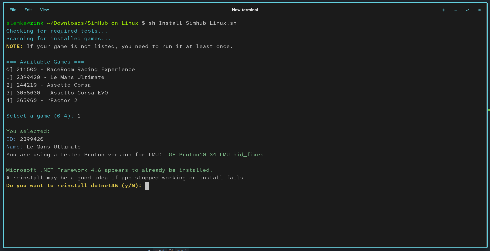

- A bash script to install SimHub, CrewChief and it's dotnet48 dependency.
- Offers to install ProtonGE and Custom LMU Proton if not present. (Recommended to use Proton-GE, much better .NET compatibility)
- You never have to run any of this as root. Do not run as root, this is Linux :)



## Requirements, those are automatically checked:

- `protontricks`
- `wget` or `curl`
- `unzip`

## Features:

- `Scans installed Steam games`
- `Checks if game has been run before to confirm a populated game prefix exists`
- `Installs dotnet48 if not already present`
- `Downloads and installs latest SimHub`
- `Gives instructions on what SimHub components to install`
- `Detects installed game used proton version, even LMU custom Proton-GE`
- `Automatically adds plugins and configures LMU`
- `Automatically adds dash.exe for RaceRomm SealHUD usage`
- `Offer installation of Proton GE, which has much better .NET compatibility`

## How to Install && run. Copy Pasta should work:
```bash
git clone https://github.com/srlemke/SimHub_on_Linux.git
cd SimHub_on_Linux/
chmod +x Install_Simhub_Linux.sh runsimhub2.sh Install_CrewChief_Linux.sh runcrewchief.sh shared_functions.sh
./Install_Simhub_Linux.sh
./runsimhub2.sh
#To Install and run CrewChief:
./Install_CrewChief_Linux.sh
./runcrewchief.sh
```

- You probably can add runsimhub2.sh command to a menu laucher with icon.

## Running:


Some details:
It works but you have to install dotnet48 and SimHUB for every game prefix.
So if you have 5 race games installed, you have to install dotnet48 and SimHUB 5 times each.
There is not really so many simulators, at least for me its no big deal, as long as it works.

There is a few other options out there that bridge the shared memory from the proton prefix to
other prefixes, I tried it but it was not super easy, this script in the end does not rely on
any additional software thats not packaged on distros which makes it usually more streamlined.
